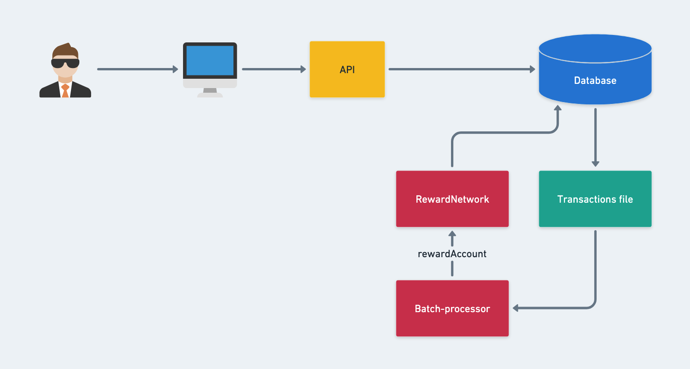

# Frequent Flyer for Groceries!
A frequent flyer system for groceries. The system is built with React and Spring Boot.  

## In This Document:
1. [Live Application URL](#live-application-url)
2. [How to Use the Application](#how-to-use-the-application)
3. [System Design](#system-design)
4. [Technologies Used](#technologies-used)
5. [Future Features](#future-features)
6. [Challenges and Learning Points](#challenges-and-learning-points)

## Live Application URL
To be added.

## How to Use the Application
1. Shopper shops at a shop.
2. The shopping transaction is send to the system.
3. The system processes transactions every 2 weeks in batch.
4. The batch processor sends each transaction to the RewardNetwork service to distribute the reward among beneficiaries.

## System Design

## Technologies Used
1. HTML, CSS, and React.
2. Spring Boot.

## Future Features:

## Challenges and Learning Points:

[Up](README.md)
